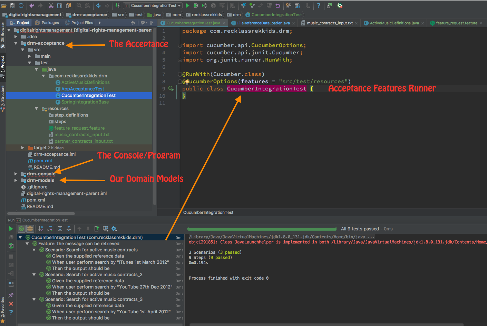

# Universal Music Technical Test

TODOs:
---
- Add acceptance Framework to parent pom
- Fix dates to printout with Ordinals
- Write more edge case tdd-unit tests and refactor code as needed
- Remove TODO markers

# Run it

## Acceptance test on CI Server

    mvn -P ci clean test

## Development test

    mvn clean test
      
## Build it

    mvn clean package

## Example command for Scenario 3

    java -jar drm-console/target/drm-console-1.0-SNAPSHOT.jar \
    "drm-console/src/main/resources/music_contracts_input.txt" \
    "drm-console/src/main/resources/partner_contracts_input.txt" \
    "YouTube 1st April 2012"

## Example Output for Scenario 3

> Effective products are:
> | Artist       | Title                   | Usages    | StartDate     | EndDate       |
> |  Tinie Tempah  |  Frisky (Live from SoHo)  |  [Ljava.lang.String;@289d1c02  |  Wed Feb 01 00:00:00 GMT 2012  |  null  |  
> |  Monkey Claw  |  Motor Mouth  |  [Ljava.lang.String;@22eeefeb  |  Tue Mar 01 00:00:00 GMT 2011  |  null  |  

----------

## Coding Problem Description

----------

A music label called Recklass Rekkids (aka RR) wants to build a Global Rights Management (aka GRM) platform to allow them to best utilise their collection of music assets.
There are legal limitations in the ways in which RR can use the assets based on the contract signed with the artist. For example Monkey Claw agreed with RR to distribute his new song 'Motor Mouth' as a digital download starting 1st of Feb 2012, and as a streaming product starting from the 1st of March.
Agreements with distribution partners also have limitations. For example iTunes only sell digital downloads, while YouTube offers a streaming service.

### Task

Create a console application that determines products available for a given partner on a given date. 
The application should accept the reference data supplied below as text file inputs. 
The user will then supply a delivery partner name and an effective date as command line inputs. 
The output should describe the current active music contracts as applicable to the partner.
We do not expect candidates to spend more than 3 hours on this task.
We do expect that the solution is developed using TDD best practises and tests are to be considered equally as important as any implementation code.

Submission checklist
The solution should include:
source code
executable application
executable tests

Note: The successful candidate will be asked to enhance this scenario as part of their onsite interview process and this exercise will be performed using IntelliJ IDEA.Text File Input #1 - Music Contracts

| Artist|Title|Usages|StartDate|EndDate |
| ----- |----- | ----- | ----- | ----- |
| Tinie Tempah|Frisky (Live from SoHo)|digital download, streaming|1st Feb 2012| |
| Tinie Tempah|Miami 2 Ibiza|digital download|1st Feb 2012| |
| Tinie Tempah|Till I'm Gone|digital download|1st Aug 2012| |
| Monkey Claw|Black Mountain|digital download|1st Feb 2012| |
| Monkey Claw|Iron Horse|digital download, streaming|1st June 2012| |
| Monkey Claw|Motor Mouth|digital download, streaming|1st Mar 2011| |
| Monkey Claw|Christmas Special|streaming|25th Dec 2012|31st Dec 2012 |

Text File Input #2 - Distribution Partner Contracts

Partner|Usage
ITunes|digital download
YouTube|streaming

### Test scenarios

Scenario: Search for active music contracts
	Given the supplied reference data
	When user perform search by ITunes 1st March 2012
	Then the output should be
	| Artist       | Title                   | Usages           | StartDate    | EndDate |
	| Monkey Claw  | Black Mountain          | digital download | 1st Feb 2012 |         |
	| Monkey Claw  | Motor Mouth             | digital download | 1st Mar 2011 |         |
	| Tinie Tempah | Frisky (Live from SoHo) | digital download | 1st Feb 2012 |         |
	| Tinie Tempah | Miami 2 Ibiza           | digital download | 1st Feb 2012 |         |

Scenario: Search for active music contracts_2
	Given the supplied reference data
	When user perform search by YouTube 27th Dec 2012
	Then the output should be
	| Artist       | Title                   | Usages    | StartDate     | EndDate       |
	| Monkey Claw  | Christmas Special       | streaming | 25th Dec 2012 | 31st Dec 2012 |
	| Monkey Claw  | Iron Horse              | streaming | 1st June 2012 |               |
	| Monkey Claw  | Motor Mouth             | streaming | 1st Mar 2011  |               |
	| Tinie Tempah | Frisky (Live from SoHo) | streaming | 1st Feb 2012  |               |

Scenario: Search for active music contracts_3
	Given the supplied reference data
	When user perform search by YouTube 1st April 2012
	Then the output should be
	| Artist       | Title                   | Usages    | StartDate    | EndDate |
	| Monkey Claw  | Motor Mouth             | streaming | 1st Mar 2011 |         |
	| Tinie Tempah | Frisky (Live from SoHo) | streaming | 1st Feb 2012 |         |
